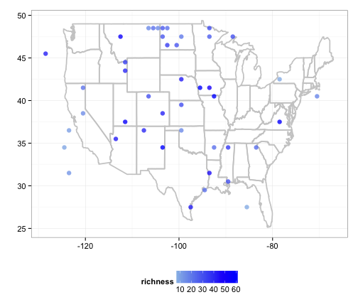

## NOAA climate data: Plot sea ice data

### Map sea ice for 12 years, for April only, for the North pole


```r
library(rnoaa)
library(scales)
library(ggplot2)
library(plyr)
```


### Get URLs for data


```r
urls <- seaiceeurls(mo = "Apr", pole = "N")[1:12]
```


### Download sea ice data


```r
out <- llply(urls, noaa_seaice, storepath = "~/")
```

```
OGR data source with driver: ESRI Shapefile 
Source: "/Users/scottmac2//extent_N_197904_polygon", layer: "extent_N_197904_polygon"
with 117 features and 1 fields
Feature type: wkbPolygon with 2 dimensions
OGR data source with driver: ESRI Shapefile 
Source: "/Users/scottmac2//extent_N_198004_polygon", layer: "extent_N_198004_polygon"
with 86 features and 1 fields
Feature type: wkbPolygon with 2 dimensions
OGR data source with driver: ESRI Shapefile 
Source: "/Users/scottmac2//extent_N_198104_polygon", layer: "extent_N_198104_polygon"
with 118 features and 1 fields
Feature type: wkbPolygon with 2 dimensions
OGR data source with driver: ESRI Shapefile 
Source: "/Users/scottmac2//extent_N_198204_polygon", layer: "extent_N_198204_polygon"
with 92 features and 1 fields
Feature type: wkbPolygon with 2 dimensions
OGR data source with driver: ESRI Shapefile 
Source: "/Users/scottmac2//extent_N_198304_polygon", layer: "extent_N_198304_polygon"
with 92 features and 1 fields
Feature type: wkbPolygon with 2 dimensions
OGR data source with driver: ESRI Shapefile 
Source: "/Users/scottmac2//extent_N_198404_polygon", layer: "extent_N_198404_polygon"
with 103 features and 1 fields
Feature type: wkbPolygon with 2 dimensions
OGR data source with driver: ESRI Shapefile 
Source: "/Users/scottmac2//extent_N_198504_polygon", layer: "extent_N_198504_polygon"
with 89 features and 1 fields
Feature type: wkbPolygon with 2 dimensions
OGR data source with driver: ESRI Shapefile 
Source: "/Users/scottmac2//extent_N_198604_polygon", layer: "extent_N_198604_polygon"
with 123 features and 1 fields
Feature type: wkbPolygon with 2 dimensions
OGR data source with driver: ESRI Shapefile 
Source: "/Users/scottmac2//extent_N_198704_polygon", layer: "extent_N_198704_polygon"
with 92 features and 1 fields
Feature type: wkbPolygon with 2 dimensions
OGR data source with driver: ESRI Shapefile 
Source: "/Users/scottmac2//extent_N_198804_polygon", layer: "extent_N_198804_polygon"
with 127 features and 1 fields
Feature type: wkbPolygon with 2 dimensions
OGR data source with driver: ESRI Shapefile 
Source: "/Users/scottmac2//extent_N_198904_polygon", layer: "extent_N_198904_polygon"
with 132 features and 1 fields
Feature type: wkbPolygon with 2 dimensions
OGR data source with driver: ESRI Shapefile 
Source: "/Users/scottmac2//extent_N_199004_polygon", layer: "extent_N_199004_polygon"
with 130 features and 1 fields
Feature type: wkbPolygon with 2 dimensions
```

```r
names(out) <- seq(1979, 1990, 1)
df <- ldply(out)
```


### Plot data


```r
ggplot(df, aes(long, lat, group = group)) + geom_polygon(fill = "steelblue") + 
    theme_ice() + facet_wrap(~.id)
```

 

